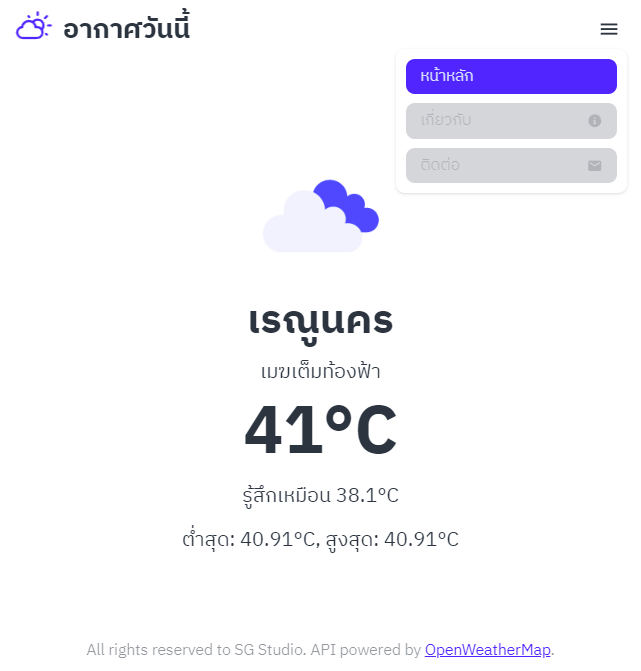

# Weather Site with Nuxt3

### About
This website is about simple weather app base on your location and time using Nuxt3 and OpenWeatherMap API 

### Development Environment
1. Node version 18.18.0
2. Firebase CLI version 13.1.0
3. Yarn version 1.22.21
4. Git bash window version 2.42.0

### Initialize Project
1. Clone this repository
    
    `git clone https://github.com/moonmangit/weather-site`

2. Firebase init

    `firebase init `

    > **Firebase CLI** you can install by `npm install -g firebase-tools@13.1.0` globally

    > **Firebase Project** you must have project before this process to create one you need to go to firebase console or by firebase CLI
    

3. Setup `Environment Variable` at `.env` file

    > you can copy `.env.example` file for the correct template

    > **Open Weather Map** you need to register and create API_KEY from [OpenWeatherMap](https://openweathermap.org) it will look like this `ebaaa48356aef4d32715cac6cbe52a1c`

4. Install dependencies

    `yarn install`

5. You good to go now, there some helper command in `package.json` which are, 

    5.1 `lint:fix`: to suggest and fixing linting error

    5.2 `build:deploy`: to build and deploy to firebase hosting service

    > to run command you need to type `yarn lint:fix` or `yarn build:deploy` ... 